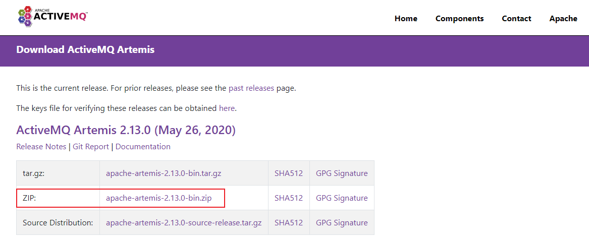
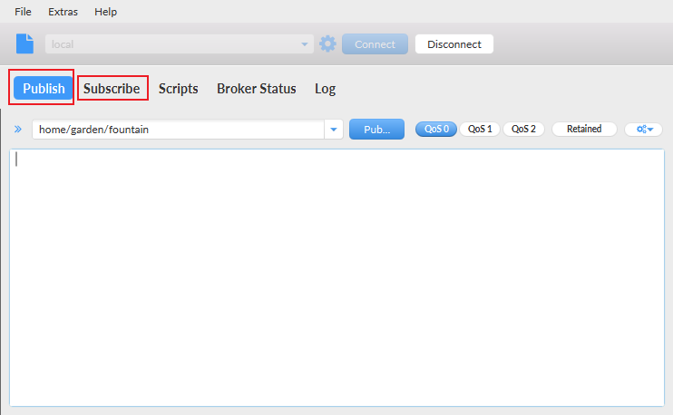

# MQTT 之 ActiveMQ 安装、测试

MQTT 是一个基于 C/S 模型的消息发布/订阅的传输协议，具有轻量、开放的特点，常用于物联网领域的智能家居等小型设备。

支持 MQTT 的服务端软件较多具体[参考](https://github.com/mqtt/mqtt.github.io/wiki/servers)，本次选用 Apache ActiveMQ Artemis。

## 安装配置

**服务端软件下载：**[ActiveQM Artemis](https://activemq.apache.org/)

由于我是 Windows 环境，所以选择如下图的第二项 zip 包。



**安装软件和开启服务**

解压 zip 包到选定的软件安装位置，进入解压后的目录，点击 README.html 文件，并参照其内容进行配置。包括：creating a broker, starting the broker.


按照上图第1、2步创建好后，可参考第3中安装、开启服务。

**登录服务控制台**

确保服务正常运行后，在浏览器访问：localhost:8161,再选择 Management Console 选项进入登录界面，填上 create broker 时输入的 user 和 password 即可。


经过以上步骤我们已经创建并开启了一个 MQTT 服务，下面需要测试服务可用性。包括从 PC 界面客户端和 Android 应用客户端进行测试。

## PC客户端测试

客户端软件选用：[MQTTfx](https://mqttfx.jensd.de/)，下载安装后点击界面中 ‘connect’ 左边的设置按钮进入。

- 1 中的地址为 MQTT 服务所在电脑的地址，Windows 上可用 ipconfig 查询。

- 2 中端口默认 1883

- 3 中为链接到服务的客户端 ID 标识，可自定义，也可用右边按钮生成，注意不要和已连接的客户端 ID 冲突。
- 4、5 点击 User Credentials 设置客户端账号密码，自定义设置，也要注意冲突。
- 最后点击右下方 OK 按钮，返回到主界面再点击 connect。
- 链接成功后，可进行相应的发布信息到某个 topic，或者订阅某个 topic 的信息。



## Android 客户端测试

**新建一个 Android studio 项目**

添加依赖

```groovy
dependencies{
    implementation 'org.eclipse.paho:org.eclipse.paho.client.mqttv3:1.2.4'
    implementation ("org.eclipse.paho:org.eclipse.paho.android.service:1.1.1")
    implementation 'androidx.legacy:legacy-support-v4:1.0.0'
}
```

注册服务和添加权限

```xml
	<uses-permission android:name="android.permission.WAKE_LOCK" />
	<uses-permission android:name="android.permission.ACCESS_NETWORK_STATE" />
	<uses-permission android:name="android.permission.INTERNET" />
	<uses-permission android:name="android.permission.READ_PHONE_STATE" />

	<service android:name="org.eclipse.paho.android.service.MqttService" />
```

具体代码参见下图

```kotlin
package com.huoergai.mqtt

import android.os.Bundle
import android.util.Log
import android.widget.Button
import androidx.appcompat.app.AppCompatActivity
import org.eclipse.paho.android.service.MqttAndroidClient
import org.eclipse.paho.client.mqttv3.*

const val serverUri = "tcp://192.168.1.2:1883"
const val clientId = "001"
const val subscriptionTopic = "pcTopic-1"
const val publishTopic = "androidTopic-1"

const val TAG = "MainActivity"

class MainActivity : AppCompatActivity() {

    var mqttClient: MqttAndroidClient? = null

    override fun onCreate(savedInstanceState: Bundle?) {
        super.onCreate(savedInstanceState)
        setContentView(R.layout.activity_main)

        val btnPublish = findViewById<Button>(R.id.btn_publish)
        btnPublish.setOnClickListener {
            publishMsg("msg:${System.currentTimeMillis()}")
        }
        mqttClient = MqttAndroidClient(this, serverUri, clientId)
        mqttClient?.setCallback(object : MqttCallback {
            override fun messageArrived(topic: String?, message: MqttMessage?) {
                Log.d("MainActivity ", "messageArrived: $topic - $message")
            }

            override fun connectionLost(cause: Throwable?) {
                Log.d("MainActivity ", " connectionLost:$cause")
            }

            override fun deliveryComplete(token: IMqttDeliveryToken?) {
                Log.d("MainActivity ", " deliveryComplete:$token")
            }
        })

        val connOption = MqttConnectOptions()
        connOption.userName = "huoergai"
        connOption.password = "10133310".toCharArray()
        connOption.isCleanSession = false
        mqttClient?.connect(connOption, null, object : IMqttActionListener {
            override fun onSuccess(asyncActionToken: IMqttToken?) {
                subscribeTopic(subscriptionTopic)
            }

            override fun onFailure(asyncActionToken: IMqttToken?, exception: Throwable?) {
                Log.d("MainActivity ", " onFailure: $serverUri :${exception?.message}")
            }
        })
    }

    private fun publishMsg(message: String) {
        val msg = MqttMessage()
        msg.payload = message.toByteArray()
        msg.qos = 0
        mqttClient?.publish(publishTopic, msg, null, object : IMqttActionListener {
            override fun onSuccess(asyncActionToken: IMqttToken?) {
                Log.d("MainActivity ", "publish onSuccess")
            }

            override fun onFailure(asyncActionToken: IMqttToken?, exception: Throwable?) {
                Log.d("MainActivity ", "publish onFailure:${exception?.message}")
            }
        })

    }

    private fun subscribeTopic(subTop: String) {
        mqttClient?.subscribe(subTop, 0, null, object : IMqttActionListener {
            override fun onSuccess(asyncActionToken: IMqttToken?) {
                Log.d("MainActivity ", " onSuccess")
            }

            override fun onFailure(asyncActionToken: IMqttToken?, exception: Throwable?) {
                Log.d("MainActivity ", " onFailure")
            }

        })

    }

}
```

**Note:** 对于不想自己搭服务，只想测试Android 端代码的可参考阿里云上的一个 [demo](https://www.alibabacloud.com/help/doc-detail/146630.htm#title-0t4-lje-mnp)，有现成服务可用，demo 亲测可用。